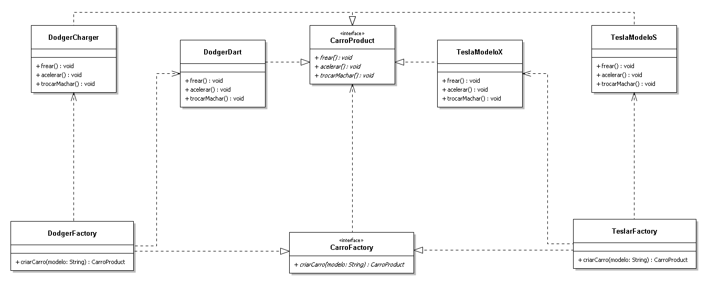
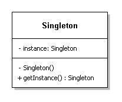
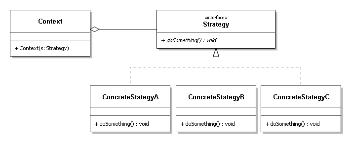

# Design Patterns Em Kotlin

Projeto mantido por [Leonardo Alves](https://www.linkedin.com/in/leoallvez/)

Inspirado por [Design-Patterns-In-Kotlin](https://github.com/dbacinski/Design-Patterns-In-Kotlin) by [Dariusz Baciński](https://www.linkedin.com/in/dbacinski)

## Designer Patterns
Design patterns (Padrões de projeto) são soluções de problemas comuns em projetos de desenvolvimento de software, essas soluções já foram amplamente estudadas, testadas e consolidadas. 

## Índice
* [Padrões de Criação](#creational)
	* [Abstract Factory](#abstract-factory)
    * [Builder](#builder)
    * [Factory Method](#factory-method)
	* [Singleton](#singleton)
* [Padrões Estruturais](#structural)
	* [Adapter](#adapter)
	* [Decorator](#decorator)
	* [Facade](#facade)
	* [Proxy](#proxy)
	* [Composite](#composite)
* [Padrões Comportamentais](#behavioral)
	* [Observer](#observer)
	* [Strategy](#strategy)
	* [Command](#command)
	* [State](#state)
	* [Chain of Responsibility](#chain-of-responsibility)
	* [Visitor](#visitor)
	* [Mediator](#mediator)
	* [Memento](#memento)


<table style="width:100%">
  <tr>
    <th>Padrões de Criação</th>
    <th>Padrões Estruturais</th>
    <th colspan="2">Padrões Comportamentais</th>
  </tr>
  <tr>
    <td>Abtract Factory</td>
    <td>Adapter</td>
    <td>Chain of Reponsibility</td>
    <td>Observer</td>
  </tr>
  <tr>
    <td>Builder</td>
    <td>Facade</td>
    <td>Command</td>
    <td>Stade</td>
  </tr>
  <tr>
    <td>Factory Method</td>
    <td>Bridge</td>
    <td>Strategy</td>
    <td>Interprete</td>
  </tr>
  <tr>
    <td>Prototype</td>
    <td>Decorator</td>
    <td>Iterator</td>
    <td>Template Method</td>
  </tr>
  <tr>
    <td>Singleton</td>
    <td>Flyweight</td>
    <td>Mediator</td>
    <td>Visitor</td>
  </tr>
  <tr>
    <td></td>
    <td>Composite</td>
    <td>Memento</td>
    <td></td>
  </tr>
   <tr>
    <td></td>
    <td>Proxy</td>
    <td></td>
    <td></td>
  </tr>
</table>


Padrões de Criação
==========

> Os padrões de criação abstraem o processo de instaciação.
> Eles ajudam a tornar um sistema independente de como seus objetos são criados, composto e representados.
> Há dois temas recorrentes nesse padrões.
> Primeiro, todos encapsulam conhecimento sobre quais classes concretas são usadas pelo sistema.
> Segundo, ocultam o modo como as instâncias destas classes concretas são criadas e compostas.
>

[Abstract Factory](/patterns/src/test/kotlin/AbstractFactory.kt)
-------------------

Fornece uma interface para a criação de famílias de objetos relacionados ou dependentes sem especificar suas classes concretas.

#### Exemplo

```kotlin
//Produto Abstrato
interface Simpson
//Produtos Concretos
class HomerSimpson : Simpson
class MargeSimpson : Simpson
//Fábrica Abstrata
abstract class SimpsonFactory {

    abstract fun makeSimpson(): Simpson

    companion object {
        inline fun <reified T : Simpson> createFactory(): SimpsonFactory =
            when (T::class) {
                HomerSimpson::class -> HomerFactory()
                MargeSimpson::class -> MargeFactory()
                else -> throw IllegalArgumentException()
            }
    }
}
//Fábricas Concretas
class HomerFactory : SimpsonFactory() {
    override fun makeSimpson(): Simpson = HomerSimpson()
}

class MargeFactory : SimpsonFactory() {
    override fun makeSimpson(): Simpson = MargeSimpson()
}
```

#### Uso

```kotlin
val simpsonFactory = SimpsonFactory.createFactory<MargeSimpson>()
val simpson = simpsonFactory.makeSimpson()
println("Simpson instanciado: $simpson")
```

#### Saída

```kotlin
Simpson instanciado: MargeSimpson@67205a84
```

[Builder](/patterns/src/test/kotlin/Builder.kt)
----------

Separa a construção de um objeto complexo de sua representação, de modo que o mesmo processo do remetente de construção possa criar diferentes representações.

#### Exemplo

```kotlin
// Let's assume that Dialog class is provided by external library.
// We have only access to Dialog public interface which cannot be changed.

class Dialog() {

    fun showTitle() = println("showing title")

    fun setTitle(text: String) = println("setting title text $text")

    fun setTitleColor(color: String) = println("setting title color $color")

    fun showMessage() = println("showing message")

    fun setMessage(text: String) = println("setting message $text")

    fun setMessageColor(color: String) = println("setting message color $color")

    fun showImage(bitmapBytes: ByteArray) = println("showing image with size ${bitmapBytes.size}")

    fun show() = println("showing dialog $this")
}

//Builder:
class DialogBuilder() {
    constructor(init: DialogBuilder.() -> Unit) : this() {
        init()
    }

    private var titleHolder: TextView? = null
    private var messageHolder: TextView? = null
    private var imageHolder: File? = null

    fun title(init: TextView.() -> Unit) {
        titleHolder = TextView().apply { init() }
    }

    fun message(init: TextView.() -> Unit) {
        messageHolder = TextView().apply { init() }
    }

    fun image(init: () -> File) {
        imageHolder = init()
    }

    fun build(): Dialog {
        val dialog = Dialog()

        titleHolder?.apply {
            dialog.setTitle(text)
            dialog.setTitleColor(color)
            dialog.showTitle()
        }

        messageHolder?.apply {
            dialog.setMessage(text)
            dialog.setMessageColor(color)
            dialog.showMessage()
        }

        imageHolder?.apply {
            dialog.showImage(readBytes())
        }

        return dialog
    }

    class TextView {
        var text: String = ""
        var color: String = "#00000"
    }
}
```

#### Uso

```kotlin
//Function that creates dialog builder and builds Dialog
fun dialog(init: DialogBuilder.() -> Unit): Dialog {
    return DialogBuilder(init).build()
}

val dialog: Dialog = dialog {
	title {
    	text = "Dialog Title"
    }
    message {
        text = "Dialog Message"
        color = "#333333"
    }
    image {
        File.createTempFile("image", "jpg")
    }
}

dialog.show()
```

#### Saída

```
setting title text Dialog Title
setting title color #00000
showing title
setting message Dialog Message
setting message color #333333
showing message
showing image with size 0
showing dialog Dialog@5f184fc6
```

[Factory Method](/patterns/src/test/kotlin/FactoryMethod.kt)
-----------------
Define uma interface para criar um objeto, mas deixa as subclasses decidirem qual classe postergar (defer) a instanciação às subclasses.



#### Exemplo

```kotlin
sealed class Country {
    object USA : Country() //Kotlin 1.0 could only be an inner class or object
}

object Spain : Country() //Kotlin 1.1 declared as top level class/object in the same file
class Greece(val someProperty: String) : Country()
data class Canada(val someProperty: String) : Country() //Kotlin 1.1 data class extends other class
//object Poland : Country()

class Currency(
    val code: String
)

object CurrencyFactory {

    fun currencyForCountry(country: Country): Currency =
        when (country) {
            is Greece -> Currency("EUR")
            is Spain -> Currency("EUR")
            is Country.USA -> Currency("USD")
            is Canada -> Currency("CAD")
        }  //try to add a new country Poland, it won't even compile without adding new branch to 'when'
}
```

#### Uso

```kotlin
val greeceCurrency = CurrencyFactory.currencyForCountry(Greece("")).code
println("Greece currency: $greeceCurrency")

val usaCurrency = CurrencyFactory.currencyForCountry(Country.USA).code
println("USA currency: $usaCurrency")

assertThat(greeceCurrency).isEqualTo("EUR")
assertThat(usaCurrency).isEqualTo("USD")
```

#### Saída

```
Greece currency: EUR
US currency: USD
UK currency: No Currency Code Available
```

[Singleton](/patterns/src/test/kotlin/Singleton.kt)
------------

Garante que uma classe tenha somente uma instância e fornece um ponto global de acesso para ela.



#### Exemplo:

```kotlin
object PrinterDriver {
    init {
        println("Initializing with object: $this")
    }

    fun print() = println("Printing with object: $this")
}
```

#### Uso

```kotlin
println("Start")
PrinterDriver.print()
PrinterDriver.print()
```

#### Saída

```
Start
Initializing with object: PrinterDriver@6ff3c5b5
Printing with object: PrinterDriver@6ff3c5b5
Printing with object: PrinterDriver@6ff3c5b5
```

Padrões Estruturais
==========

>Na engenharia de software, os padrões de design estrutural são padrões de design que facilitam o design, identificando uma maneira simples de realizar relacionamentos entre entidades.
>
>

[Adapter](/patterns/src/test/kotlin/Adapter.kt)
----------

Converte a interface de uma classe em outra interface esperada pelos clientes. O Adapter permite que certas classes trabalhem em conjunto, pois, de outra forma seria impossível por causa de suas interfaces incompatíveis.

#### Exemplo

```kotlin
interface Temperature {
    var temperature: Double
}

class CelsiusTemperature(override var temperature: Double) : Temperature

class FahrenheitTemperature(var celsiusTemperature: CelsiusTemperature) : Temperature {

    override var temperature: Double
        get() = convertCelsiusToFahrenheit(celsiusTemperature.temperature)
        set(temperatureInF) {
            celsiusTemperature.temperature = convertFahrenheitToCelsius(temperatureInF)
        }

    private fun convertFahrenheitToCelsius(f: Double): Double = (f - 32) * 5 / 9

    private fun convertCelsiusToFahrenheit(c: Double): Double = (c * 9 / 5) + 32
}

```

#### Uso

```kotlin
val celsiusTemperature = CelsiusTemperature(0.0)
val fahrenheitTemperature = FahrenheitTemperature(celsiusTemperature)

celsiusTemperature.temperature = 36.6
println("${celsiusTemperature.temperature} C -> ${fahrenheitTemperature.temperature} F")

fahrenheitTemperature.temperature = 100.0
println("${fahrenheitTemperature.temperature} F -> ${celsiusTemperature.temperature} C")
```

#### Saída

```
36.6 C -> 97.88000000000001 F
100.0 F -> 37.77777777777778 C
```

[Decorator](/patterns/src/test/kotlin/Decorator.kt)
------------

Atribuir indefensabilidades adicionais a um objeto dinamicamente. Os decorators fornecem uma alternativa flexível as subclasses para extensão da funcionalidade.

#### Exemplo

```kotlin
interface CoffeeMachine {
    fun makeSmallCoffee()
    fun makeLargeCoffee()
}

class NormalCoffeeMachine : CoffeeMachine {
    override fun makeSmallCoffee() = println("Normal: Making small coffee")

    override fun makeLargeCoffee() = println("Normal: Making large coffee")
}

//Decorator:
class EnhancedCoffeeMachine(val coffeeMachine: CoffeeMachine) : CoffeeMachine by coffeeMachine {

    // overriding behaviour
    override fun makeLargeCoffee() {
        println("Enhanced: Making large coffee")
        coffeeMachine.makeLargeCoffee()
    }

    // extended behaviour
    fun makeCoffeeWithMilk() {
        println("Enhanced: Making coffee with milk")
        coffeeMachine.makeSmallCoffee()
        println("Enhanced: Adding milk")
    }
}
```

#### Uso

```kotlin
    val normalMachine = NormalCoffeeMachine()
    val enhancedMachine = EnhancedCoffeeMachine(normalMachine)

    // non-overridden behaviour
    enhancedMachine.makeSmallCoffee()
    // overriding behaviour
    enhancedMachine.makeLargeCoffee()
    // extended behaviour
    enhancedMachine.makeCoffeeWithMilk()
```

#### Saída

```
Normal: Making small coffee

Enhanced: Making large coffee
Normal: Making large coffee

Enhanced: Making coffee with milk
Normal: Making small coffee
Enhanced: Adding milk
```

[Façade (ou Facade)](/patterns/src/test/kotlin/Facade.kt)
---------

Fornece uma interface unificada para um conjunto de interfaces em um subsistema. O Façade define uma interface de nível mais alto que torna o subsistema fácil de usar.

#### Exemplo

```kotlin
class ComplexSystemStore(val filePath: String) {

    init {
        println("Reading data from file: $filePath")
    }

    val store = HashMap<String, String>()

    fun store(key: String, payload: String) {
        store.put(key, payload)
    }

    fun read(key: String): String = store[key] ?: ""

    fun commit() = println("Storing cached data: $store to file: $filePath")
}

data class User(val login: String)

//Facade:
class UserRepository {
    val systemPreferences = ComplexSystemStore("/data/default.prefs")

    fun save(user: User) {
        systemPreferences.store("USER_KEY", user.login)
        systemPreferences.commit()
    }

    fun findFirst(): User = User(systemPreferences.read("USER_KEY"))
}
```

#### Uso

```kotlin
val userRepository = UserRepository()
val user = User("dbacinski")
userRepository.save(user)
val resultUser = userRepository.findFirst()
println("Found stored user: $resultUser")
```

#### Saída

```
Reading data from file: /data/default.prefs
Storing cached data: {USER_KEY=dbacinski} to file: /data/default.prefs
Found stored user: User(login=dbacinski)
```

[Proxy](/patterns/src/test/kotlin/ProtectionProxy.kt)
------------------

Fornece um objeto representante ou um marcador de outro objeto para controlar o acesso ao mesmo.

#### Exemplo

```kotlin
interface File {
    fun read(name: String)
}

class NormalFile : File {
    override fun read(name: String) = println("Reading file: $name")
}

//Proxy:
class SecuredFile : File {
    val normalFile = NormalFile()
    var password: String = ""

    override fun read(name: String) {
        if (password == "secret") {
            println("Password is correct: $password")
            normalFile.read(name)
        } else {
            println("Incorrect password. Access denied!")
        }
    }
}
```

#### Uso

```kotlin
val securedFile = SecuredFile()
securedFile.read("readme.md")

securedFile.password = "secret"
securedFile.read("readme.md")
```

#### Saída

```
Incorrect password. Access denied!
Password is correct: secret
Reading file: readme.md
```


[Composite](/patterns/src/test/kotlin/Composite.kt)
------------------

Compõe objetos em estrutura de árvore para representar hierarquia do tipo partes-todos. O Composite permite que os clientes tratem objetos individuais e composições de objetos de maneira uniforme.

#### Exemplo

```kotlin

open class Equipment(private var price: Int, private var name: String) {
    open fun getPrice(): Int = price
}


/*
[composite]
*/

open class Composite(name: String) : Equipment(0, name) {
    val equipments = ArrayList<Equipment>()

    fun add(equipment: Equipment) {
        this.equipments.add(equipment);
    }

    override fun getPrice(): Int {
        return equipments.map { it -> it.getPrice() }.sum()
    }
}


/*
 leafs
*/

class Cabbinet : Composite("cabbinet")
class FloppyDisk : Equipment(70, "Floppy Disk")
class HardDrive : Equipment(250, "Hard Drive")
class Memory : Equipment(280, "Memory")


```

#### Uso

```kotlin
var cabbinet = Cabbinet()
cabbinet.add(FloppyDisk())
cabbinet.add(HardDrive())
cabbinet.add(Memory())
println(cabbinet.getPrice())
```

#### Saída

```
600
```


Padrões Comportamentais
==========

>Na engenharia de software, os padrões de design comportamental são padrões de design que identificam padrões de comunicação comuns entre objetos e realizam esses padrões. Ao fazer isso, esses padrões aumentam a flexibilidade na realização dessa comunicação.
>
>

[Observer](/patterns/src/test/kotlin/Listener.kt)
--------

Define uma dependência uma-para-muitos entre objetos, de modo que, quando um objeto muda de estado, todos os seus dependentes são automaticamente notificados e atualizados.

#### Exemplo

```kotlin
interface TextChangedListener {

    fun onTextChanged(oldText: String, newText: String)
}

class PrintingTextChangedListener : TextChangedListener {
    
    var text = ""
    
    override fun onTextChanged(oldText: String, newText: String) {
        text = "Text is changed: $oldText -> $newText"
    }
}

class TextView {

    val listeners = mutableListOf<TextChangedListener>()

    var text: String by Delegates.observable("<empty>") { _, old, new ->
        listeners.forEach { it.onTextChanged(old, new) }
    }
}
```

#### Uso

```kotlin
val textView = TextView().apply {
    listener = PrintingTextChangedListener()
}

with(textView) {
    text = "Lorem ipsum"
    text = "dolor sit amet"
}
```

#### Saída

```
Text is changed <empty> -> Lorem ipsum
Text is changed Lorem ipsum -> dolor sit amet
```

[Strategy](/patterns/src/test/kotlin/Strategy.kt)
-----------

Define uma família de algoritmos encapsula cada um deles e os torna intercambiáveis. O Strategy permite que o algoritmo varie.


#### Exemplo

```kotlin
class Printer(private val stringFormatterStrategy: (String) -> String) {

    fun printString(string: String) {
        println(stringFormatterStrategy(string))
    }
}

val lowerCaseFormatter: (String) -> String = { it.toLowerCase() }
val upperCaseFormatter = { it: String -> it.toUpperCase() }
```

#### Uso

```kotlin
val inputString = "LOREM ipsum DOLOR sit amet"

val lowerCasePrinter = Printer(lowerCaseFormatter)
lowerCasePrinter.printString(inputString)

val upperCasePrinter = Printer(upperCaseFormatter)
upperCasePrinter.printString(inputString)

val prefixPrinter = Printer { "Prefix: $it" }
prefixPrinter.printString(inputString)
```

#### Saída

```
lorem ipsum dolor sit amet
LOREM IPSUM DOLOR SIT AMET
Prefix: LOREM ipsum DOLOR sit amet
```

[Command](/patterns/src/test/kotlin/Command.kt)
-------

Encapsula uma solicitação como um objeto, desta forma permitindo que você parametrize clientes com diferentes solicitações, enfileire ou registre (log) solicitações e suporte operações que podem se desfeitas.

#### Exemplo:

```kotlin
interface OrderCommand {
    fun execute()
}

class OrderAddCommand(val id: Long) : OrderCommand {
    override fun execute() = println("Adding order with id: $id")
}

class OrderPayCommand(val id: Long) : OrderCommand {
    override fun execute() = println("Paying for order with id: $id")
}

class CommandProcessor {

    private val queue = ArrayList<OrderCommand>()

    fun addToQueue(orderCommand: OrderCommand): CommandProcessor =
        apply {
            queue.add(orderCommand)
        }

    fun processCommands(): CommandProcessor =
        apply {
            queue.forEach { it.execute() }
            queue.clear()
        }
}
```

#### Uso

```kotlin
CommandProcessor()
    .addToQueue(OrderAddCommand(1L))
    .addToQueue(OrderAddCommand(2L))
    .addToQueue(OrderPayCommand(2L))
    .addToQueue(OrderPayCommand(1L))
    .processCommands()
```

#### Saída

```
Adding order with id: 1
Adding order with id: 2
Paying for order with id: 2
Paying for order with id: 1
```

[State](/patterns/src/test/kotlin/State.kt)
------

Permite que um objeto altere seu comportamento quando seu estado interno muda. O objeto parecerá ter mudado de classe.

#### Exemplo

```kotlin
sealed class AuthorizationState

object Unauthorized : AuthorizationState()

class Authorized(val userName: String) : AuthorizationState()

class AuthorizationPresenter {

    private var state: AuthorizationState = Unauthorized

    val isAuthorized: Boolean
        get() = when (state) {
            is Authorized -> true
            is Unauthorized -> false
        }

    val userName: String
        get() {
            val state = this.state //val enables smart casting of state
            return when (state) {
                is Authorized -> state.userName
                is Unauthorized -> "Unknown"
            }
        }

    fun loginUser(userName: String) {
        state = Authorized(userName)
    }

    fun logoutUser() {
        state = Unauthorized
    }

    override fun toString() = "User '$userName' is logged in: $isAuthorized"
}
```

#### Uso

```kotlin
val authorizationPresenter = AuthorizationPresenter()

authorizationPresenter.loginUser("admin")
println(authorizationPresenter)

authorizationPresenter.logoutUser()
println(authorizationPresenter)
```

#### Saída

```
User 'admin' is logged in: true
User 'Unknown' is logged in: false
```

[Chain of Responsibility](/patterns/src/test/kotlin/ChainOfResponsibility.kt)
-----------------------
Evita o acoplamento do remetente de uma solicitação ao seu destinatário, dando a mais de um objeto a chance de tratar a solicitação. Encadeia os objetos receptores e passa a solicitação ao longo da cadeia até que um objeto a trate.

#### Exemplo

```kotlin
interface HeadersChain {
    fun addHeader(inputHeader: String): String
}

class AuthenticationHeader(val token: String?, var next: HeadersChain? = null) : HeadersChain {

    override fun addHeader(inputHeader: String): String {
        token ?: throw IllegalStateException("Token should be not null")
        return inputHeader + "Authorization: Bearer $token\n"
            .let { next?.addHeader(it) ?: it }
    }
}

class ContentTypeHeader(val contentType: String, var next: HeadersChain? = null) : HeadersChain {

    override fun addHeader(inputHeader: String): String =
        inputHeader + "ContentType: $contentType\n"
            .let { next?.addHeader(it) ?: it }
}

class BodyPayload(val body: String, var next: HeadersChain? = null) : HeadersChain {

    override fun addHeader(inputHeader: String): String =
        inputHeader + "$body"
            .let { next?.addHeader(it) ?: it }
}
```

#### Uso

```kotlin
//create chain elements
val authenticationHeader = AuthenticationHeader("123456")
val contentTypeHeader = ContentTypeHeader("json")
val messageBody = BodyPayload("Body:\n{\n\"username\"=\"dbacinski\"\n}")

//construct chain
authenticationHeader.next = contentTypeHeader
contentTypeHeader.next = messageBody

//execute chain
val messageWithAuthentication =
    authenticationHeader.addHeader("Headers with Authentication:\n")
println(messageWithAuthentication)

val messageWithoutAuth =
    contentTypeHeader.addHeader("Headers:\n")
println(messageWithoutAuth)
```

#### Saída

```
Headers with Authentication:
Authorization: Bearer 123456
ContentType: json
Body:
{
"username"="dbacinski"
}

Headers:
ContentType: json
Body:
{
"username"="dbacinski"
}
```

[Visitor](/patterns/src/test/kotlin/Visitor.kt)
-------

Representa uma operação a ser executada sobre os elementos da estrutura de um objeto. O visitor permite que você defina uma nova operação sem mudar as classes dos elementos sobre os quais opera.
#### Exemplo

```kotlin
interface ReportVisitable {
    fun <R> accept(visitor: ReportVisitor<R>): R
}

class FixedPriceContract(val costPerYear: Long) : ReportVisitable {
    override fun <R> accept(visitor: ReportVisitor<R>): R = visitor.visit(this)
}

class TimeAndMaterialsContract(val costPerHour: Long, val hours: Long) : ReportVisitable {
    override fun <R> accept(visitor: ReportVisitor<R>): R = visitor.visit(this)
}

class SupportContract(val costPerMonth: Long) : ReportVisitable {
    override fun <R> accept(visitor: ReportVisitor<R>): R = visitor.visit(this)
}

interface ReportVisitor<out R> {

    fun visit(contract: FixedPriceContract): R
    fun visit(contract: TimeAndMaterialsContract): R
    fun visit(contract: SupportContract): R
}

class MonthlyCostReportVisitor : ReportVisitor<Long> {

    override fun visit(contract: FixedPriceContract): Long =
        contract.costPerYear / 12

    override fun visit(contract: TimeAndMaterialsContract): Long =
        contract.costPerHour * contract.hours

    override fun visit(contract: SupportContract): Long =
        contract.costPerMonth
}

class YearlyReportVisitor : ReportVisitor<Long> {

    override fun visit(contract: FixedPriceContract): Long =
        contract.costPerYear

    override fun visit(contract: TimeAndMaterialsContract): Long =
        contract.costPerHour * contract.hours

    override fun visit(contract: SupportContract): Long =
        contract.costPerMonth * 12
}
```

#### Uso

```kotlin
val projectAlpha = FixedPriceContract(costPerYear = 10000)
val projectGamma = TimeAndMaterialsContract(hours = 150, costPerHour = 10)
val projectBeta = SupportContract(costPerMonth = 500)
val projectKappa = TimeAndMaterialsContract(hours = 50, costPerHour = 50)

val projects = arrayOf(projectAlpha, projectBeta, projectGamma, projectKappa)

val monthlyCostReportVisitor = MonthlyCostReportVisitor()

val monthlyCost = projects.map { it.accept(monthlyCostReportVisitor) }.sum()
println("Monthly cost: $monthlyCost")
assertThat(monthlyCost).isEqualTo(5333)

val yearlyReportVisitor = YearlyReportVisitor()
val yearlyCost = projects.map { it.accept(yearlyReportVisitor) }.sum()
println("Yearly cost: $yearlyCost")
assertThat(yearlyCost).isEqualTo(20000)
```

#### Saída

```
Monthly cost: 5333
Yearly cost: 20000
```

[Mediator](/patterns/src/test/kotlin/Mediator.kt)
-------

Mediator design pattern is used to provide a centralized communication medium between different objects in a system. This pattern is very helpful in an enterprise application where multiple objects are interacting with each other.
#### Exemplo

```kotlin
class ChatUser(private val mediator: ChatMediator, val name: String) {
    fun send(msg: String) {
        println("$name: Sending Message= $msg")
        mediator.sendMessage(msg, this)
    }

    fun receive(msg: String) {
        println("$name: Message received: $msg")
    }
}

class ChatMediator {

    private val users: MutableList<ChatUser> = ArrayList()

    fun sendMessage(msg: String, user: ChatUser) {
        users
            .filter { it != user }
            .forEach {
                it.receive(msg)
            }
    }

    fun addUser(user: ChatUser): ChatMediator =
        apply { users.add(user) }

}
```

#### Uso

```kotlin
val mediator = ChatMediator()
val john = ChatUser(mediator, "John")

mediator
    .addUser(ChatUser(mediator, "Alice"))
    .addUser(ChatUser(mediator, "Bob"))
    .addUser(john)
john.send("Hi everyone!")
```

#### Saída

```
John: Sending Message= Hi everyone!
Alice: Message received: Hi everyone!
Bob: Message received: Hi everyone!
```

[Memento](/patterns/src/test/kotlin/Memento.kt)
-------
Sem violar o encapsulamento, captura e externaliza um estado interno de um objeto, de modo que o mesmo possa posteriormente ser restaurado para este estado.

#### Exemplo
```kotlin
data class Memento(val state: String)

class Originator(var state: String) {

    fun createMemento(): Memento {
        return Memento(state)
    }

    fun restore(memento: Memento) {
        state = memento.state
    }
}

class CareTaker {
    private val mementoList = ArrayList<Memento>()

    fun saveState(state: Memento) {
        mementoList.add(state)
    }

    fun restore(index: Int): Memento {
        return mementoList[index]
    }
}
```

#### Uso
```kotlin
val originator = Originator("initial state")
val careTaker = CareTaker()
careTaker.saveState(originator.createMemento())

originator.state = "State #1"
originator.state = "State #2"
careTaker.saveState(originator.createMemento())

originator.state = "State #3"
println("Current State: " + originator.state)
assertThat(originator.state).isEqualTo("State #3")

originator.restore(careTaker.restore(1))
println("Second saved state: " + originator.state)
assertThat(originator.state).isEqualTo("State #2")

originator.restore(careTaker.restore(0))
println("First saved state: " + originator.state)
```

#### Saída
```
Current State: State #3
Second saved state: State #2
First saved state: initial state
```


